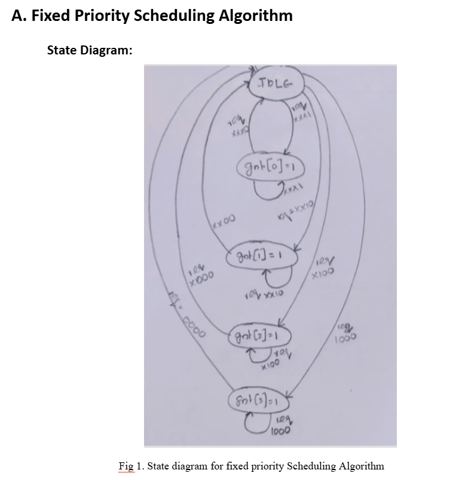
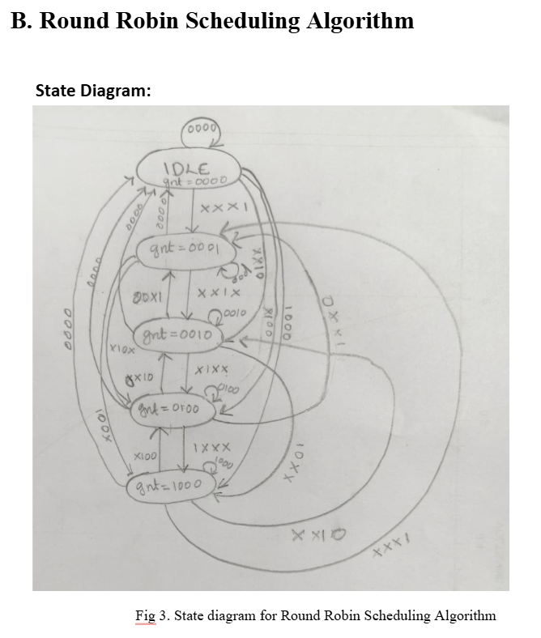
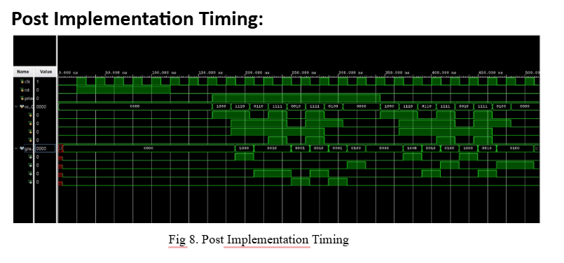

# Hybrid Fixed-Priority + Round Robin Arbiter (FPGA Implementation)

This project presents the **design and implementation of two widely used hardware arbitration mechanisms—Round Robin Arbiter and Priority-Based Arbiter—using Verilog HDL**. Arbiters play a crucial role in digital systems where multiple clients compete for shared resources such as buses or memory interfaces. The Priority Arbiter allocates access based on fixed priority levels, ensuring low-latency service for high-priority clients, while the **Round Robin Arbiter** rotates priority among all requesters to guarantee fairness and eliminate starvation.

The design is modeled as a **Finite State Machine (FSM), simulated using Vivado**, and verified through behavioral, post-synthesis, and post-implementation timing simulations. Performance parameters such as latency, grant duration, resource utilization, and throughput are analyzed to evaluate the efficiency of both schemes. The results demonstrate that the implementation is lightweight, scalable, and suitable for integration into SoC and bus-based systems requiring efficient request–grant arbitration.

---

## Fixed Priority Scheduling Algorithm

## Round Robin FSM

## Simulation Waveform

